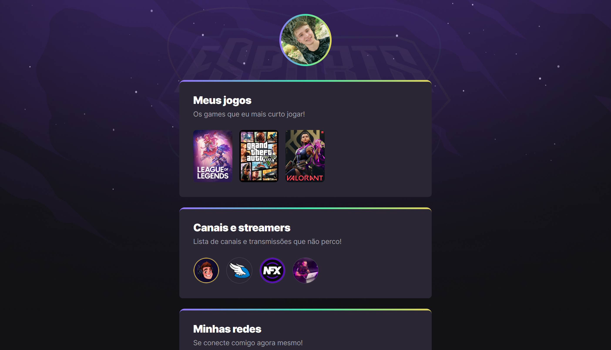

# <strong>NLW eSports</strong>

> Trilha Explorer

Projeto construido no evento <strong>Next Level Week da Rocketseat</strong>, no qual desenvolvemos um site baseado em games, no qual foi colocado os jogos que amo jogar, streamers que assisto e as minhas redes sociais.

Para acessar o projeto, <strong>[clique aqui](https://luanbauler.github.io/NLW-eSports/)</strong>

# Tecnologias utilizadas:

> HTML

> CSS

> Git e Github

# Sobre o evento:

O evento se baseia em duas trilhas: <strong>Explorer</strong> e <strong>Ignite</strong>.

Explorer, o qual eu participei, é designado a pessoas iniciantes na programação ou que já estão estudando, mas querem aprofundar os fundamentos da programação.

Ignite é designado para pessoas que já programam a mais tempo, e que já possuem uma base sólida na programação, mas que querem se aperfeiçoar, melhorar técnicas e se desenvolver mais ainda no mundo da tecnologia.

Evento incrível, com muito conhecimento e prática, e feito com pessoas que amam programar e que se dedicam inteiramente a isso, fazendo assim um evento completo e único no mundo da programação!

# Entre em contato

<strong>E-mail:</strong> luan.mbauler@gmail.com
